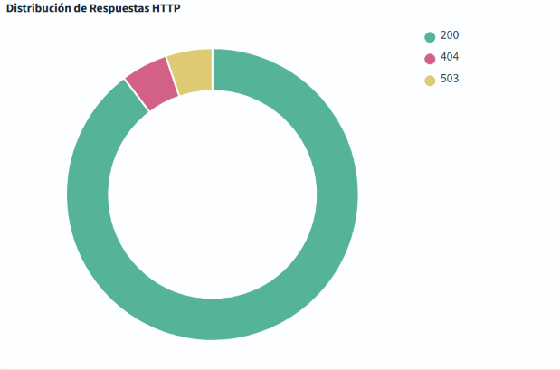
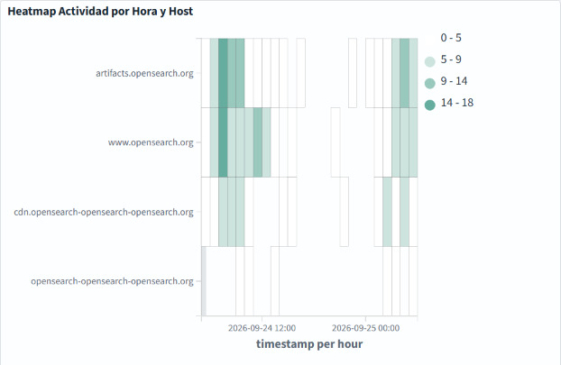
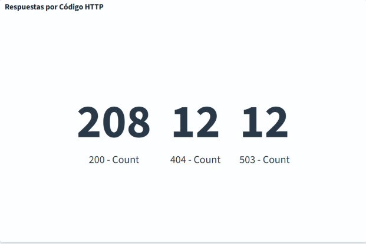
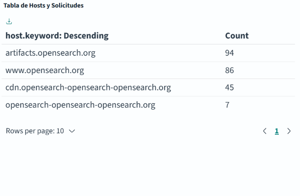
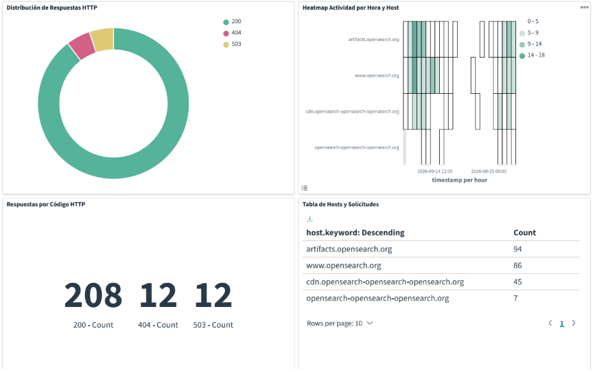

# Visualizaciones - OpenSearch Dashboards

## 1. Distribución de Respuestas HTTP (Pie Chart)

**Tipo:** Pie Chart
**Index:** opensearch_dashboards_sample_data_logs
**Métrica:** Count
**Agregación:** Terms - Field: response.keyword

**Propósito:** Mostrar el porcentaje de respuestas por código HTTP (200, 404, 503).

---

## 2. Heatmap Actividad por Hora y Host

**Tipo:** Heatmap
**Index:** opensearch_dashboards_sample_data_logs
**Métrica:** Count
**X-axis:** Date histogram - Field: timestamp - Interval: 9 months
**Y-axis:** Terms - Field: host.keyword

**Propósito:** Visualizar patrones de actividad por tiempo y servidor.

---

## 3. Respuestas por Código HTTP (Metric)

**Tipo:** Metric (Number)
**Index:** opensearch_dashboards_sample_data_logs
**Métrica:** Count agrupado por response.keyword

**Propósito:** Mostrar el conteo exacto de cada tipo de respuesta HTTP.

---

## 4. Tabla de Hosts y Solicitudes (Data Table)

**Tipo:** Data Table
**Index:** opensearch_dashboards_sample_data_logs
**Agregación:** Terms - Field: host.keyword - Size: 20
**Métrica:** Count

**Propósito:** Tabla interactiva con hosts y su número de solicitudes.

---

## 5. Dasboard 

